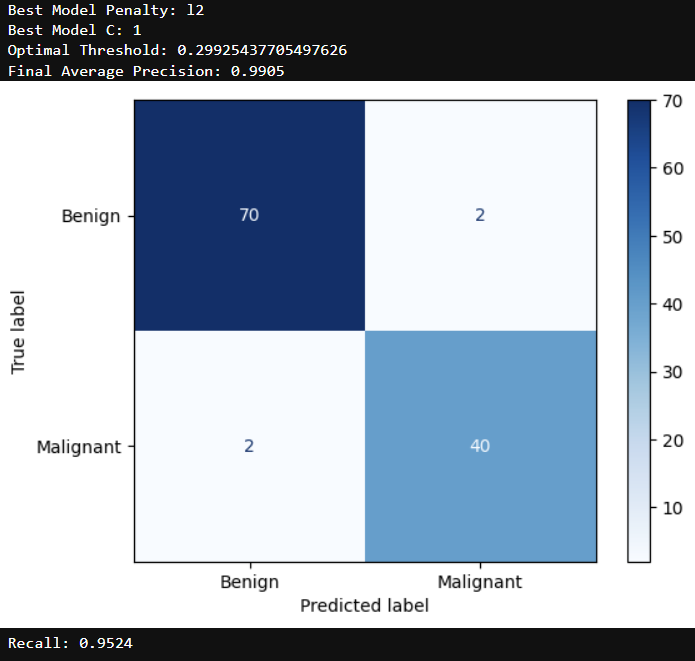

# Breast Cancer Diagnostic Classifier

## Overview
A machine learning pipeline designed to classify breast cancer tumors from real-world medical data. This project focuses on minimizing high-risk false negatives in medical diagnoses by dynamically adjusting classification thresholds, ultimately prioritizing and achieving a 95% recall rate. 

## Dataset
* **Source:** UCI Machine Learning Repository
* **Description:** 569 instances with 30 numerical features computed from a digitized image of a fine needle aspirate (FNA) of a breast mass

## Methodology

### 1. Data Preprocessing & Feature Engineering
* **Feature Scaling:** Applied standard scaling to normalize feature distributions for faster model convergence and also to ensure that regularization applies penalties equally across features.
* **Multicollinearity Handling:** Analyzed the feature correlation matrix and systematically dropped highly redundant variables to improve model interpretability and reduce variance.

### 2. Modeling & Regularization
Logistic Regression models are evaluated across three penalty states: Unregularized, L1 (Lasso), and L2 (Ridge). All 3 models frequently had similar confusion matrices, decision boundaries, and recalls. However, the L1 Regularized model achieved this diagnostic power while driving the weights of 8 features to zero. This means that the L1 logistic regression model requires less data, optimizing both computational and diagnostic efficiency.

The objective function of L1 logistic regression minimizes the log-loss of unregularized logistic regression alongside the L1 penalty:
$$J(w) = - \frac{1}{m} \sum_{i=1}^{m} [y^{(i)} \log(h_w(x^{(i)})) + (1 - y^{(i)}) \log(1 - h_w(x^{(i)}))] + \lambda \sum_{j=1}^{n} |w_j|$$

### 3. Custom Evaluation Function
Standard accuracy metrics are insufficient for medical diagnostics where a false negative (missed cancer diagnosis) carries a drastically higher cost than a false positive. A custom evaluation function was designed to dynamically adjust the decision boundary to achieve a **95% recall rate** on the test set.

### 4. Finding the Optimal Model
Since these outputs can vary based on the randomness of the data split, use GridSearchCV to perform K-Fold Cross Validation in order to choose the best combination of logistic regression regularization penalty and hyperparameter

### 5. Evaluate Optimal Model
Use previously defined functions in order to find the optimal threshold of the optimal model based on the validation set and then display key metrics like recall and average precision score
Optimal Model Evaluation:


## Installation & Usage

Clone the repository and install the required dependencies:

```bash
git clone [https://github.com/jjkim680/tumor-classifier.git](https://github.com/jjkim680/tumor-classifier.git)
cd tumor-classifier
pip install -r requirements.txt
